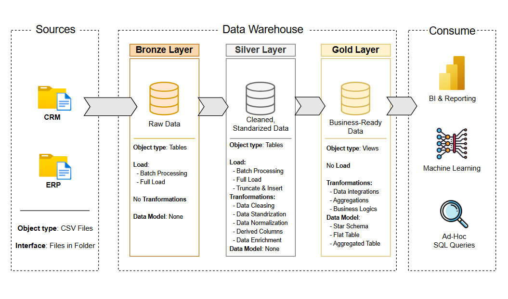

# 📊 SQL Analytics & Data Warehouse Project


This repository contains all SQL scripts, Data Analysis queries, and Data Warehouse development code created while completing the **"SQL Full Course for Beginners"** by [Data with Baraa](https://www.youtube.com/watch?v=SSKVgrwhzus).

---
## 🏗️ Data Architecture

The data architecture for this project follows Medallion Architecture **Bronze**, **Silver**, and **Gold** layers:


1. **Bronze Layer**: Stores raw data as-is from the source systems. Data is ingested from CSV Files into SQL Server Database.
2. **Silver Layer**: This layer includes data cleansing, standardization, and normalization processes to prepare data for analysis.
3. **Gold Layer**: Houses business-ready data modeled into a star schema required for reporting and analytics.

---
## 📌 Project Overview

The main goal of this repository is to showcase end-to-end SQL proficiency, progressing from fundamental concepts to advanced techniques applied in real-world **Data Engineering** and **Data Analytics** scenarios.

## 📖 Key Topics Covered
- **Foundations & DDL/DML:** Table creation, schema design, and data manipulation (`INSERT`, `UPDATE`, `DELETE`).
- **Filtering & Intermediate Queries:** Logical operators, data aggregations (`GROUP BY`, `HAVING`), combining datasets with `JOINS`.
- **Built-in Functions & Data Transformation:** String manipulation, date functions, null handling (`ISNULL`, `COALESCE`), and conditional logic (`CASE`).
- **Advanced Analytics (Window Functions):** Ranking functions.
- **Data Architecture:** Designing a Modern Data Warehouse using Medallion Architecture **Bronze**, **Silver** and **Gold** layers.
- **ETL Pipelines:** Extracting, transforming, and loading data from source systems into the warehouse.
- **Data Modeling:** Developing fact and dimension tables optimized for analytical queries.
---

## 🚀 Project Requirements

### Building the Data Warehouse (Data Engineering)

#### Objective
Develop a modern data warehouse using SQL Server to consolidate sales data, enabling analytical reporting and informed decision-making.

#### Specifications
- **Data Sources**: Import data from two source systems (ERP and CRM) provided as CSV files.
- **Data Quality**: Cleanse and resolve data quality issues prior to analysis.
- **Integration**: Combine both sources into a single, user-friendly data model designed for analytical queries.
- **Scope**: Focus on the latest dataset only; historization of data is not required.
- **Documentation**: Provide clear documentation of the data model to support both business stakeholders and analytics teams.
---

## 📂 Repository Structure
```
data-warehouse-project/
│
├── datasets/                           # Raw datasets used for the project (ERP and CRM data)
│
├── docs/                               # Project documentation and architecture details
│   ├── data_architecture.png           # PNG file shows the project's architecture
│   ├── data_catalog.md                 # Catalog of datasets, including field descriptions and metadata
│   ├── data_flow.png                   # PNG file for the data flow diagram
│   ├── data_models.png                 # PNG file for data models (star schema)
│   ├── naming-conventions.md           # Consistent naming guidelines for tables, columns, and files
│
├── scripts/                            # SQL scripts for ETL and transformations
│   ├── bronze/                         # Scripts for extracting and loading raw data
│   ├── silver/                         # Scripts for cleaning and transforming data
│   ├── gold/                           # Scripts for creating analytical models
│
├── tests/                              # Test scripts and quality files
│
├── README.md                           # Project overview and instructions
└── LICENSE                             # License information for the repository

```
---
## 🤝 Acknowledgments

Special thanks to Baraa ([Data with Baraa]([https://www.youtube.com/@DataWithBaraa])) for providing this comprehensive free tutorial series.

💡 Developed by [Your Name] as part of my Data Engineering & Analytics portfolio.
